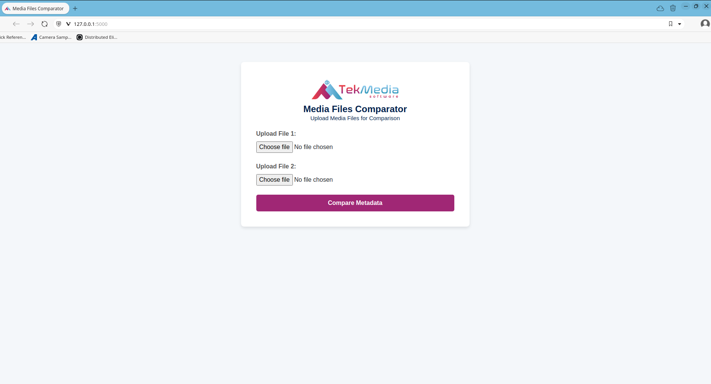
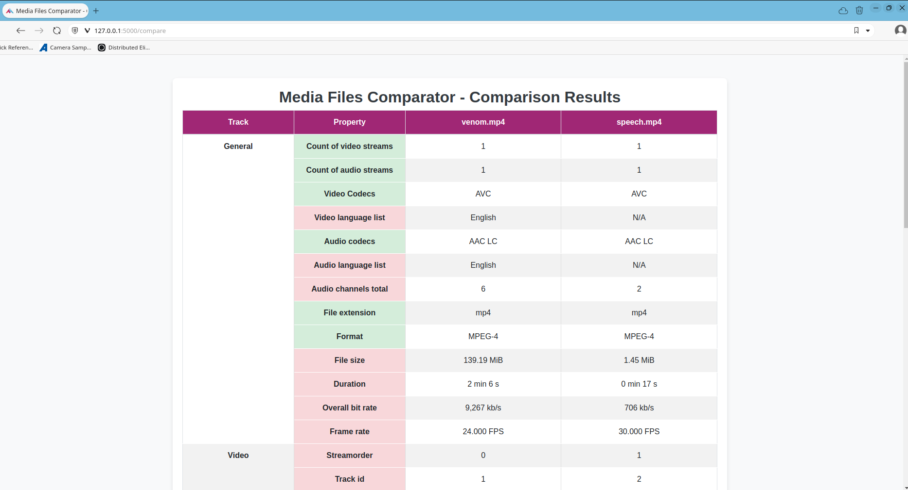
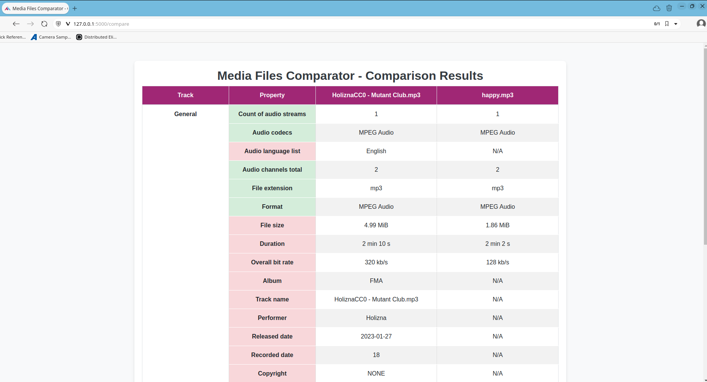
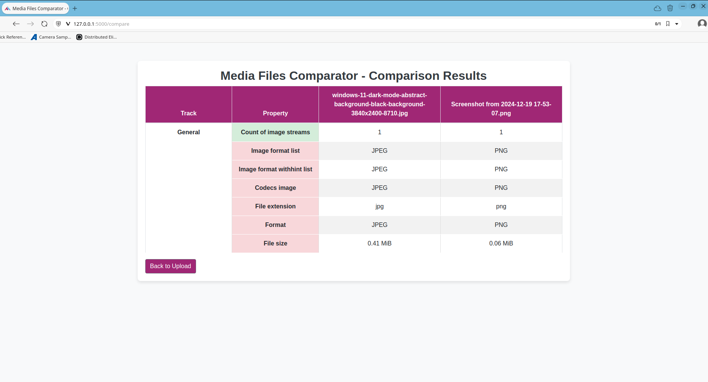

# TekMedia Media Files Comparator

A comprehensive media comparison tool designed to compare multimedia files based on various attributes, including resolution, bitrate, and more. The project allows users to easily analyze and compare media files to identify optimal settings for streaming or playback.

## Table of Contents

1. [Introduction](#introduction)
2. [Features](#features)
3. [Installation](#installation)
4. [Usage](#usage)
5. [Contact](#contact)
6. [Contributing](#contributing)
7. [License](#license)

## Introduction

Media Files Comparator is built to simplify the comparison of media files, focusing on streamlining the evaluation of video and audio files for quality assessment, metadata extraction, and file attribute comparison. It is designed to be an easy-to-use tool for professionals in media production, broadcasting, and streaming.

## Features

- **Video Comparison**: Compares video attributes like resolution, bitrate, and encoding settings.
- **Audio Comparison**: Evaluates audio properties, such as bitrate, sample rate, and codec.
- **Metadata Extraction**: Extracts and displays essential metadata from media files.
- **Multimedia Analysis**: Provides insights on optimal media settings for various use cases.

## Installation

### Prerequisites

Before you begin, ensure you have met the following requirements:

- **Software**:
  - Python 3.x
  - pip (Python package installer)
  
- **Libraries**:
  - Install dependencies via the `requirements.txt` file.

### Steps

1. Clone the repository:
```
git clone https://github.com/TekMedia-Software/Media-Files-Comparator.git
```
2. Change directory:
```
cd Media-Files-Comparator
```
3. Install dependencies:
```
pip install -r requirements.txt
```

## Usage

After installing the necessary dependencies, you can start the project. Here’s how:

1. Navigate to the project directory:
```
cd Media-Files-Comparator
```
2. Run the main script to begin using the tool:
```
python3 app.py
```

## Sample Screenshots

- **Main Page**


- **Main Page - Files Uploaded**


- **Comparison of Video Files**


- **Comparison of Audio Files**


- **Comparison of Image Files**


## Contact

For any questions or feedback, please reach out:

- Awadh Bajpai - [awabaj@tekmediasoft.net](mailto:awabaj@tekmediasoft.net)
- Nikileshwar Anbukumaran - [nikanb@tekmediasoft.net](mailto:nikanb@tekmediasoft.net)

## Acknowledgements

- **Libraries**: Thanks to [MediaInfo](https://mediaarea.net/en/MediaInfo) for metadata extraction from media files.

## Contributing

We welcome contributions! Please see the [CONTRIBUTING.md](CONTRIBUTING.md) file for detailed guidelines on how to contribute to this project.

## License

This project is licensed under a proprietary license. All rights reserved. You may modify and use this software for personal purposes, but for any production use, reproduction, modification, or distribution, prior written permission from [**TekMedia Software Services**](https://tekmediasoft.com) is required.

